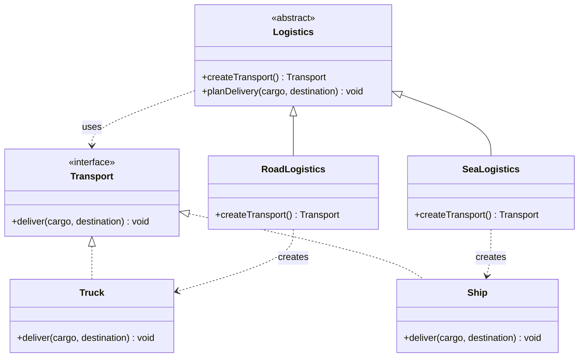
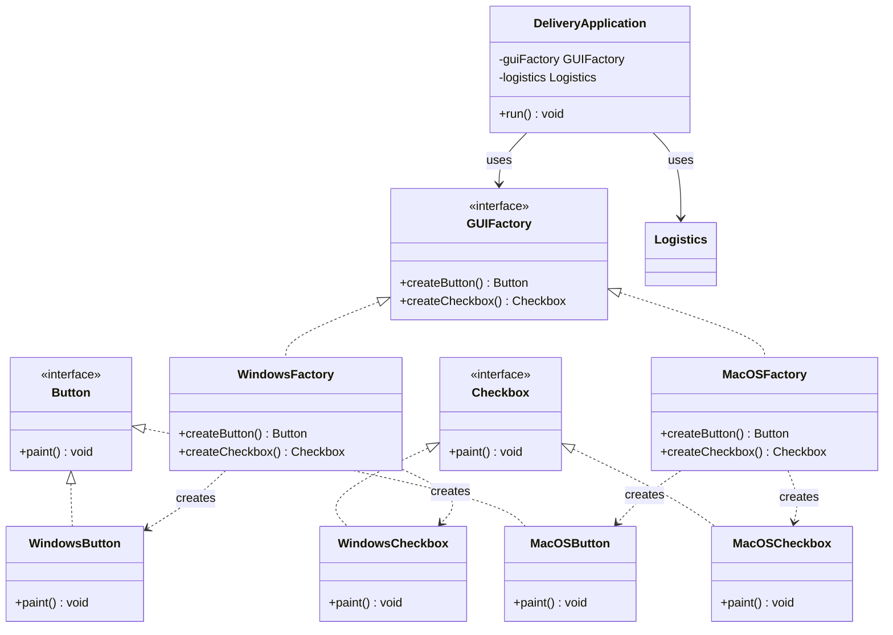

# UML Diagrams

## Factory Method

```mermaid
classDiagram
    class Transport {
        <<interface>>
        +deliver(cargo, destination) void
    }

    class Truck {
        +deliver(cargo, destination) void
    }

    class Ship {
        +deliver(cargo, destination) void
    }

    class Logistics {
        <<abstract>>
        +createTransport() Transport
        +planDelivery(cargo, destination) void
    }

    class RoadLogistics {
        +createTransport() Transport
    }

    class SeaLogistics {
        +createTransport() Transport
    }

    Transport <|.. Truck
    Transport <|.. Ship
    Logistics <|-- RoadLogistics
    Logistics <|-- SeaLogistics
    Logistics ..> Transport : uses
    RoadLogistics ..> Truck : creates
    SeaLogistics ..> Ship : creates
```

## Abstract Factory

```mermaid
classDiagram
    class Button {
        <<interface>>
        +paint() void
    }

    class Checkbox {
        <<interface>>
        +paint() void
    }

    class WindowsButton {
        +paint() void
    }

    class WindowsCheckbox {
        +paint() void
    }

    class MacOSButton {
        +paint() void
    }

    class MacOSCheckbox {
        +paint() void
    }

    class GUIFactory {
        <<interface>>
        +createButton() Button
        +createCheckbox() Checkbox
    }

    class WindowsFactory {
        +createButton() Button
        +createCheckbox() Checkbox
    }

    class MacOSFactory {
        +createButton() Button
        +createCheckbox() Checkbox
    }

    class DeliveryApplication {
        -guiFactory GUIFactory
        -logistics Logistics
        +run() void
    }

    Button <|.. WindowsButton
    Button <|.. MacOSButton
    Checkbox <|.. WindowsCheckbox
    Checkbox <|.. MacOSCheckbox
    GUIFactory <|.. WindowsFactory
    GUIFactory <|.. MacOSFactory
    WindowsFactory ..> WindowsButton : creates
    WindowsFactory ..> WindowsCheckbox : creates
    MacOSFactory ..> MacOSButton : creates
    MacOSFactory ..> MacOSCheckbox : creates
    DeliveryApplication --> GUIFactory : uses
    DeliveryApplication --> Logistics : uses
```
